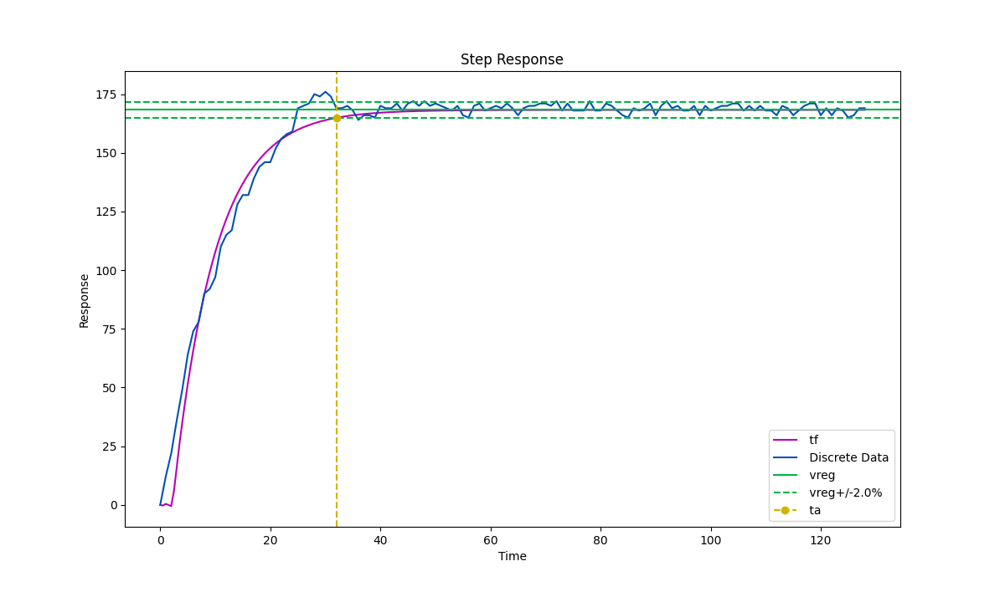
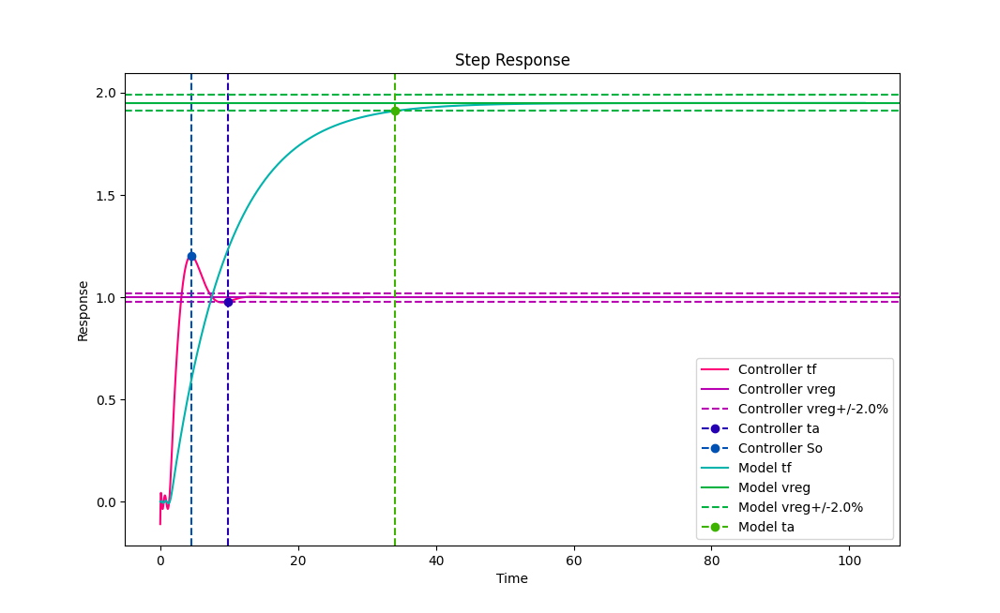

**********
Introdução
**********

.. include:: shared/general.rst

.. include:: shared/dependencies.rst

Início Rápido
-------------

Antes de mais nada é necessário importar a biblioteca, isso pode ser feito da seguinte forma:

>>> import auto_control_tools as act

As funcionalidades desta biblioteca incluem :term:`Identificação` de :term:`Modelo` de um :term:`Sistema`, a posterior
:term:`Aproximação de Ganhos` de um :term:`Controlador PID` e a visualização dos dados e comportamento do :term:`Modelo`
do :term:`Sistema` em :term:`Malha Aberta` e dele em :term:`Malha Fechada` com o :term:`Controlador PID` gerado.

Para obter um modelo, simplesmente instancie um objeto de modelo diretamente com :class:`~auto_control_tools.Model` ou
:class:`~auto_control_tools.FirstOrderModel`:

Instanciamento direto de :term:`Modelo`:

>>> model = act.Model((
>>>    [1],
>>>    [1, 2]
>>> ))

>>> model = act.FirstOrderModel(K=1, tau=2, theta=0.5)

Ou escolha um dos :ref:`identif`, para esse exemplo utilizaremos
:class:`~auto_control_tools.NishikawaModelIdentification`.

Nesse caso serão necessários os dados discretos de resposta do :term:`Sistema`. Um leiaute para preenchimento dos
dados bode ser obtido através do método :meth:`~auto_control_tools.NishikawaModelIdentification.get_data_input_layout`:

>>> layout_path = act.NishikawaModelIdentification.get_data_input_layout('path/to/folder')

Uma vez com o leiaute preenchido, o método :meth:`~auto_control_tools.NishikawaModelIdentification.get_model` pode ser
utilizado para obtenção do :class:`~auto_control_tools.Model` por :term:`Identificação`:

>>> model = act.NishikawaModelIdentification.get_model(layout_path)

Com :class:`~auto_control_tools.Model` em mãos, é possível visualizar seu comportamento, e até comparar com os dados
discretos do :term:`Sistema`:

>>> model.view.print_tf()

.. math::
    \frac{ 168.26 }{ 7.71s + 1 }e^{-2.22s}

>>> model.view.print_model_step_response_data()
{'Overshoot': 0,
 'Peak': 168.03545714435953,
 'PeakTime': 52.5444563372188,
 'RiseTime': 16.672760183925195,
 'SettlingMax': 168.2608695652174,
 'SettlingMin': 151.45062634600725,
 'SettlingTime': 31.998226615614012,
 'SteadyStateValue': 168.2608695652174,
 'Undershoot': 0.6269575101889905}

>>> model.view.plot_model_step_response_graph()

Para obter o controlador, é possível simplesmente instancia-lo com base em um :class:`~auto_control_tools.Model` e
na especificação dos ganhos de :term:`Controlador PID` de forma direta:

>>> controller = act.Controller(model, Kp=1, Ki=1, Kd=1)

Ou pode ser escolhido um dos :ref:`gain-aprox`, para este exemplo,
:class:`~auto_control_tools.CohenCoonControllerAproximation`.

Para utilizar este método basta fornecer um modelo e o tipo de controlador desejado:

>>> controller = act.CohenCoonControllerAproximation(model, act.PID)

Com :class:`~auto_control_tools.Controller` em mãos, é possível visualizar seu comportamento, e até comparar com os
dados discretos do :class:`~auto_control_tools.Model` em :term:`Malha Aberta`:

>>> model = act.FirstOrderModel(K=1.95, tau=8.33, theta=1.48)
>>> controller = act.CohenCoonControllerAproximation.get_controller(model, act.PID)
>>> controller.view.print_tf()

.. math::

    \frac{1.95 \left(0.52s + 3.98 + \frac{3.39}{s}\right) \exp(-1.48s)}{\left(1 + \frac{1.95
    \left(0.52s + 3.98 + \frac{3.39}{s}\right) \exp(-1.48s)}{8.33s + 1.0}\right) \left(8.33s + 1.0\right)}

>>> controller.view.print_controller_step_response_data()
{'Kd': 0.5213405222539381,
 'Ki': 3.393417131440939,
 'Kp': 3.9766689766689765,
 'Overshoot': 20.40652189650112,
 'Peak': 1.2040652189650112,
 'PeakTime': 4.478154203547828,
 'RiseTime': 1.3154577972921744,
 'SettlingMax': 1.2040652189650112,
 'SettlingMin': 0.9001418058725997,
 'SettlingTime': 9.823950784033048,
 'SteadyStateValue': 1.0,
 'Undershoot': 10.87681610040138}

>>> controller.view.plot_controller_step_response_graph()

Mais informações sobre o funcionamento podem ser encontradas em :ref:`function` ou na :ref:`class-ref`.

.. _function:

Funcionamento
-------------

O funcionamento geral da biblioteca é explicado abaixo, para a documentação detalhada do funcionamento de itens
específicos referir-se a :ref:`class-ref`.

Base
++++

As ferramentas dessa biblioteca partem do pre suposto de que haja um :term:`Sistema` para o qual se deseja um
:term:`Modelo` e posteriormente os ganhos de um :term:`Controlador PID`.

Para isso, foram desenvolvidas duas classes representativas do :term:`Modelo` em :term:`Malha Aberta` e do
:term:`Modelo` em :term:`Malha Fechada` com um :term:`Controlador PID`, :class:`~auto_control_tools.Model`
e :class:`~auto_control_tools.Controller`, respectivamente.

:class:`~auto_control_tools.Model` model é uma representação do :term:`Modelo`, e guarda sua
:term:`Função de Transferência`, bem como outros dados que podem ser relevantes, como os dados discretos, caso tenha
sido obtido por algum dos :ref:`identif`.

:class:`~auto_control_tools.Controller` guarda o modelo e também faz o fechamento da malha com os ganhos de
:term:`Controlador PID` fornecidos, guardando também a :term:`Função de Transferência` do
:term:`Modelo` em :term:`Malha Fechada` com um :term:`Controlador PID`.

Identificação
+++++++++++++

Para a :term:`Identificação` por dados discretos, são necessários os dados, e para isso todos os :ref:`identif`
fornecem o método :meth:`~auto_control_tools.BaseModelIdentification.get_data_input_layout`, que faz o salvamento da
planilha de leiaute vazia no formato escolhido, com os campos resultantes (Alguns campos podem ser informados de forma
estática na :term:`Identificação` do modelo, não havendo necessidade de estarem no leiaute de input mais detalhes em
:meth:`~auto_control_tools.BaseModelIdentification.get_data_input_layout`). Todos os :ref:`identif` possuem o método
:meth:`~auto_control_tools.BaseModelIdentification.get_model` que espera o caminho dos dados preenchidos.

Todos os :ref:`identif` implementam o método :meth:`~auto_control_tools.BaseModelIdentification.get_model`
e aplicam alguma heurística para obtenção de uma :term:`Função de Transferência` representativa do :term:`Sistema`
que gerou os dados. A forma como cada método faz isso varia, é necessário ver a documentação do método em específico
para determinar se funcionamento ou mesmo verificar se ele necessita de informações adicionais que não apenas os
dados de resposta do :term:`Sistema`.

O resultado da aplicação dos :ref:`identif` é um objeto da classe :class:`~auto_control_tools.Model` ou de uma de suas
subclasses, como é o caso de :class:`~auto_control_tools.FirstOrderModel` - uma implementação especializada em um caso
específico de sistemas de primeira ordem com atraso.

Aproximação de Controlador
++++++++++++++++++++++++++

Todos os :ref:`gain-aprox` implementam o método :meth:`~auto_control_tools.BaseControllerAproximation.get_controller`
e aplicam alguma heurística para obtenção dos ganhos de :term:`Controlador PID` com base nos dados de
:class:`~auto_control_tools.Model`. A forma como cada método faz isso varia, é necessário ver a documentação do
método em específico para determinar se funcionamento ou mesmo verificar se ele necessita de informações adicionais
que não apenas os dados de :class:`~auto_control_tools.Model`.

O resultado da aplicação dos :ref:`gain-aprox` é um objeto da classe :class:`~auto_control_tools.Controller`.

Visualização de Dados
+++++++++++++++++++++

Tanto :class:`~auto_control_tools.Model` quanto :class:`~auto_control_tools.Controller`
implementam um atributo `view` da classe
:class:`~auto_control_tools.ModelView` e :class:`~auto_control_tools.ControllerView`, respectivamente.
Através desse atributo é possível acessar métodos de visualização de dados como a visualização da
:term:`Função de Transferência`, dos dados de resposta a sinal degrau ou mesmo o plot da resposta a sinal degrau do
:term:`Sistema` em um gráfico.

Detalhes sober a implementação de :class:`~auto_control_tools.ModelView` e :class:`~auto_control_tools.ControllerView`
podem ser observados da documentação das próprias classes.
